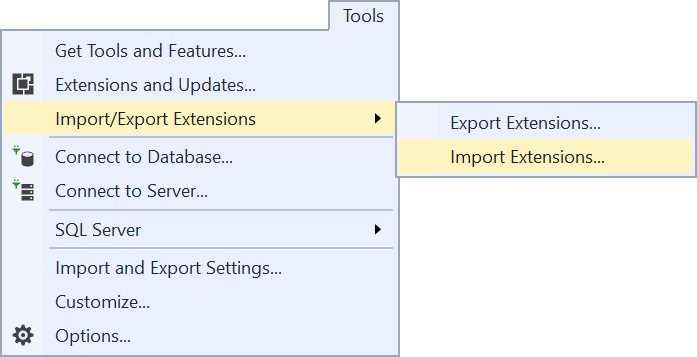
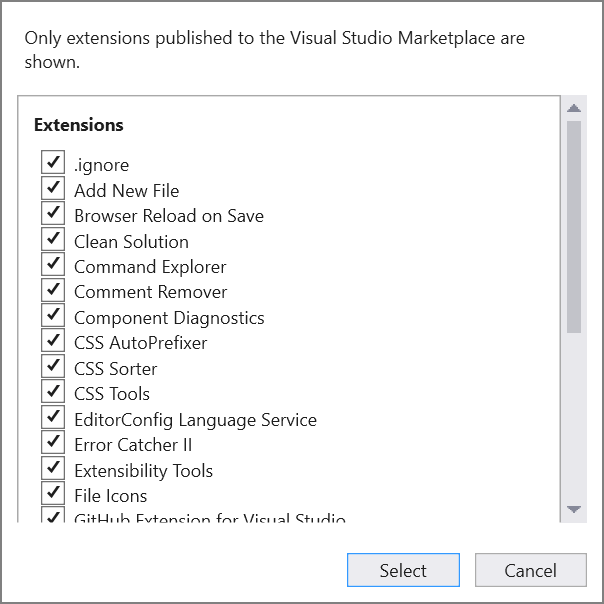
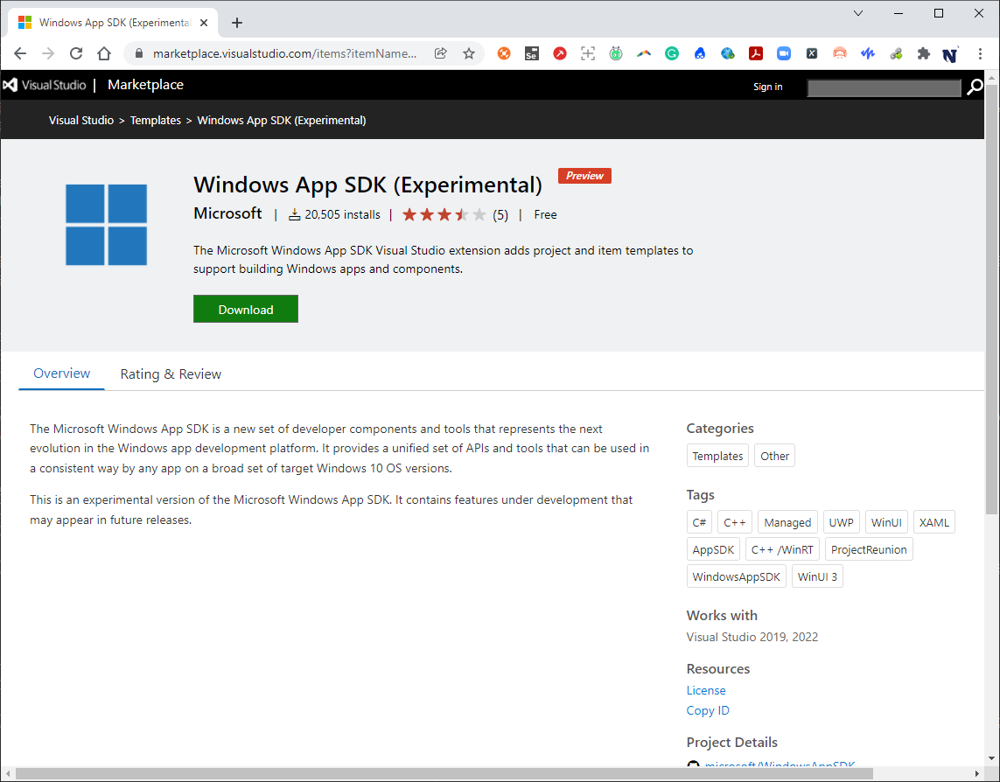
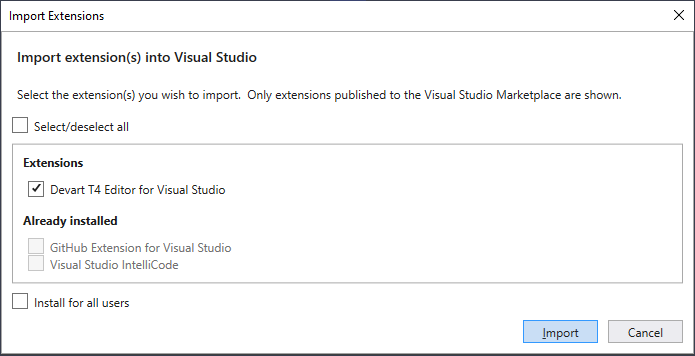
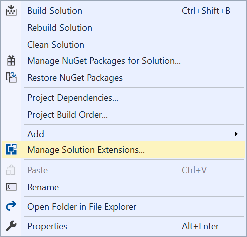
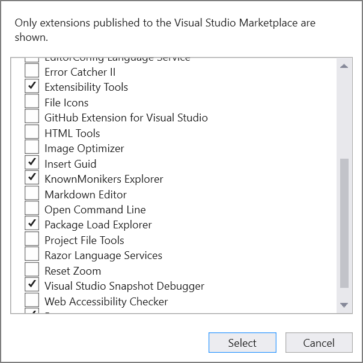

# Import/Export Visual Studio extensions

[](https://ci.appveyor.com/project/madskristensen/extensionpacktools)

Download the extension from the [Visual Studio Marketplace](https://marketplace.visualstudio.com/items?itemName=MadsKristensen.ExtensionManager) or get the latest [CI build](http://vsixgallery.com/extension/e83d71b8-8bfc-4e06-b145-b0388910c016/)

--------------------------------------

This extension allows you to export a list of extensions and importing them back into any instance of VS 2017.


**Figure 1.** The **Export Extensions** and **Import Extensions** menu commands.

## Export

The **Export Extensions** dialog box appears that lets you select which extensions you wish to export.

Check the boxes for the extension(s) you wish to export, and then click **Export** to perform the operation.

Click the **Select/deselect all** to toggle back and forth between selecting or deselecting all the extensions in the list.


**Figure 2.** The **Export Extensions** dialog box.

The output is a JSON file with an `.vsext` file extension looking like this:

```json
{
  "id": "49481cf2-0f02-462e-b8b7-9ecc53fee721",
  "name": "My Visual Studio extensions",
  "description": "A collection of my Visual Studio extensions",
  "version": "1.0",
  "extensions": [
    {
      "name": "Add Multiple Projects To Solution",
      "vsixId": "2ed01419-2b11-4128-a2ca-0adfa0fc7498",
      "moreInfoUrl": "https://marketplace.visualstudio.com/items?itemName=MaciejGudanowicz.AddMultipleProjectsToSolution",
      "downloadUrl": "https://maciejgudanowicz.gallery.vsassets.io:443/_apis/public/gallery/publisher/MaciejGudanowicz/extension/AddMultipleProjectsToSolution/1.2.0/assetbyname/Microsoft.VisualStudio.Ide.Payload?redirect=true&update=true"
    },
    {
      "name": "Add New File",
      "vsixId": "2E78AA18-E864-4FBB-B8C8-6186FC865DB3",
      "moreInfoUrl": "https://marketplace.visualstudio.com/items?itemName=MadsKristensen.AddNewFile",
      "downloadUrl": "https://madskristensen.gallery.vsassets.io:443/_apis/public/gallery/publisher/MadsKristensen/extension/AddNewFile/3.5.160/assetbyname/Microsoft.VisualStudio.Ide.Payload?redirect=true&update=true"
    },
    {
      "name": "Advanced Installer for Visual Studio 2019",
      "vsixId": "Caphyon.AdvancedInstaller.5a62525e-63ff-4f65-8949-c5e3f35bf9a8",
      "moreInfoUrl": "https://marketplace.visualstudio.com/items?itemName=caphyon.AdvancedInstallerforVisualStudio2019",
      "downloadUrl": "https://caphyon.gallery.vsassets.io:443/_apis/public/gallery/publisher/caphyon/extension/AdvancedInstallerforVisualStudio2019/19.0/assetbyname/Microsoft.VisualStudio.Ide.Payload?redirect=true&update=true"
    }
  ]
}
```

### New export fields

Of note are new entries: `moreInfoUrl` and `downloadUrl` for each extension.  These are now exported along with the `vsixId` and `name` fields.

#### The `moreInfoUrl` field

The `moreInfoUrl` field points to the Visual Studio Marketplace page of the extension.  If you open this URL in a Web browser, then the Visual Studio marketplace will show that extension's page:


**Figure 3.** Google Chrome opened to the URL in the `moreInfoUrl` field for the `Windows App SDK (Experimental)` extension.

#### The `downloadUrl` field

The `downloadUrl` field points to the URL that a `HTTP GET` request can be issued to in order to obtain the `.vsix` file of the extension itself.

### Example use case for new export fields

The file can be parsed by a custom script you write.  The use case is, e.g., say a Sysadmin at a large organization needs to install the same suite of extensions into all the Visual Studio 2019 instances in a computer lab.

For such a use case, the procedure is as follows:

1. Configure a 'reference' workstation's copy of Visual Studio with the set of extensions you want.
2. Also install this extension.
3. Do an `Export Extensions` operation from the menu command.
4. Save the `.vsext` file to a common location where your script can see it.
5. Download and install the extensoins, using your script, across all your computer-lab machines.

## Import
Clicking the import button prompts you to select a `.vsext` file. Doing that will present you with the **Import Extensions** dialog that lists all the extensions found in the `.vsext` file you selected.


**Figure 4.** The **Import Extensions** dialog box.

Before showing the list it will verify that the extensions exist on the Marketplace and that can take a few seconds.

Any extensions in the import file that are already installed in Visual Studio will be grayed out.

Clicking the **Import** button in the dialog will start the VSIX Installer in a separate process and you can follow the normal install flow from there.

## Manage solution extensions
This allows you to specify which extensions needed to work on any given solution. When a developer opens the solution and doesn't have one or more of the extensions installed, they are prompted to install them.

Right-click the solution to manage the extensions.


**Figure 5.** Context menu for the Solution level of **Solution Explorer**.

This will show this dialog where you can pick wich of your extensions to associate with the solution.


**Figure 6.** The **Manage Solution Extensions** dialog box.

To create a `.vsext` file containing the checked extensions in a location on the local disk that is next to the Solution file (`.sln`), check the extensions you want, and then click the **Select** button.  

You have the option to commit the generated .vsext file to souce control.  This is highly recommended.

## License
[Apache 2.0](LICENSE)
